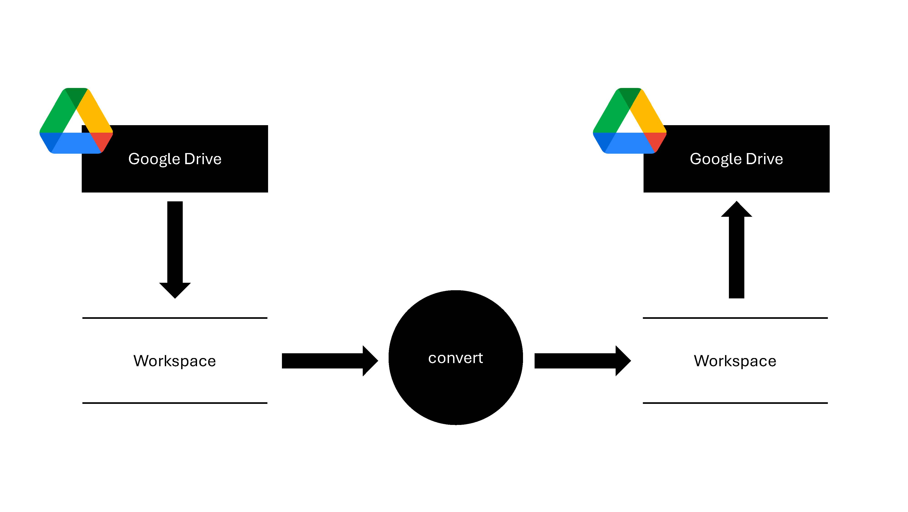

# Audio-Format-Conversion

This Python-based tool automates the process of converting `.m4a` audio files to `.mp3` format on Google Drive. Utilizing the Google Drive API and `pydub`, this tool downloads `.m4a` files from Google Drive, converts them, and then uploads the `.mp3` files back to the drive.

## Getting Started

These instructions will guide you through setting up the project on your local machine for development and usage.

### Prerequisites

You will need the following to run this project:

- Python 3.x
- Pip package manager
- Google Drive API credentials in the form of a `credentials.json` file

### Installation

To set up the project, follow these steps:

Clone the repository to your local machine:

```bash 
git clone https://github.com/your-username/Audio-Format-Conversion.git
```
Change directory into the project:
```bash 
cd Audio-Format-Conversion
```
Install the required dependencies:
```bash 
pip install -r requirements.txt
```

## Google Drive API Setup

Before using the tool, you need to configure your Google Drive API credentials:

1. Go to the [Google Developers Console](https://console.developers.google.com/).
2. Create a new project and enable the Google Drive API for it.
3. Create credentials for the project and download the `credentials.json` file.
4. Place the `credentials.json` file in the `config` project directory.

## Authentication

To authenticate with the Google Drive API, you will need to use the `quickstart.py` script. Provide the script with the paths to your `token_path` and `credentials_path`:

```bash
python setup_authentication.py --token_path <path/to/your/credentials.json> <path/to/your/token.json>
```
This command initializes the authentication process and stores the necessary tokens for API access.

## Processing Files

Once authenticated, you can use the run.py script to perform the audio file processing. Specify the directories for raw and processed data using the following command:

```bash
python drive_conversion.py --input_data_dir <path/to/your/raw_data_directory> --output_data_dir <path/to/your/processed_data_directory> --input_format <input_format_suffix> --output_format <output_format_suffix>
```
This script will download .m4a files from the specified raw_data_dir, convert them to .mp3 format, and save the processed files to the processed_data_dir.


## Built With

* [Google Drive API](https://developers.google.com/drive/api/v3/about-sdk) - The API used for interacting with Google Drive.
* [PyDub](http://pydub.com/) - The library used for audio file manipulation.
* [Python](https://www.python.org/) - The programming language used.

## Authors

* **Your Name** - *Initial work* - [ArthurZakirov](https://github.com/ArthurZakirov)


## License

This project is licensed under the MIT License - see the [LICENSE.md](LICENSE.md) file for details.

